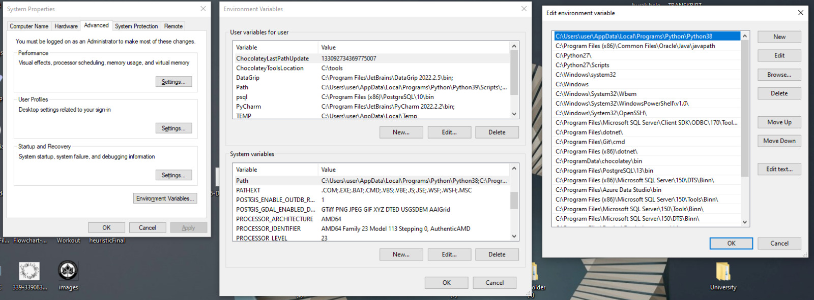

## Heuristic Algorithms - Parallel Processing

### 1. Python version configuration:
It is recommended to run this code using `Python 3.9`. You can check your python version using following command:
```
python --version
```
If your version is different then recommended version please download and install python from official [repository](https://www.python.org/downloads/). Don't forget to check add python to PATH variable option while installing so you can run python in terminal.

In case you installed required version and terminal output is still lower version then expected, you need to edit PATH variable in a way that Python3.9. path entry is listed  before other versions in the Enviroment Variables>System Variables>PATH. Don't forget to restart terminal after changing the path variable.



### 2. Install CUDA Drivers - CUDA toolkit
Next CUDA drivers need to be installed. Version used while working on this repository is `11.3.`. You can download and install CUDA from official Nvidia [repository](https://developer.nvidia.com/cuda-11.3.0-download-archive).

### 3. Unzip the codebase and install required packages via pip:
```
## INSTALL REQUIRED PACKAGES
## execute following code
## line by line
## directly in your terminal

pip3 install numba
pip3 install matplotlib
pip3 install TQDM==4.62
pip3 install torch==1.10.0+cu102 torchvision==0.11.1+cu102 torchaudio===0.10.0+cu102 -f https://download.pytorch.org/whl/cu102/torch_stable.html

```
### 4. Run Code
To run code, navigate to code directory and run .py files directly from the terminal. 

```
## for example to run PSO:
cd PSO
python PSO.py
```